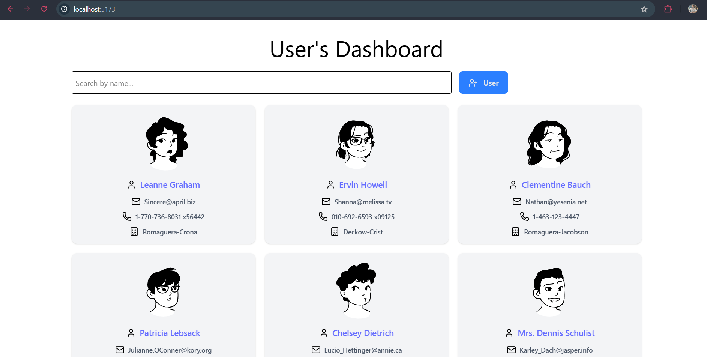
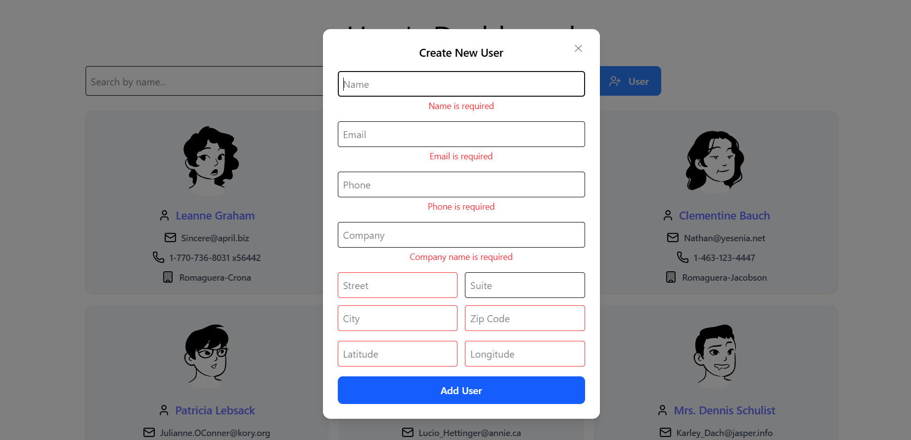
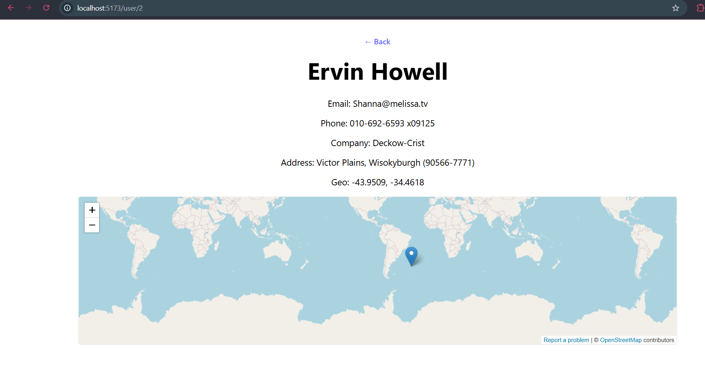

# **User Dashboard**

A simple React app that displays a list of users, allows searching, adding new users, and viewing detailed information with a map.

# Features

Fetch and display users with name, email, phone, and company


Search/filter users by name


Add new users via a modal form


User details page with full info and embedded map


Responsive layout with TailwindCSS

Avatars generated using DiceBear

# Tech Stack

React + Vite + TypeScript

TailwindCSS

React Router DOM

React Hook Form

Context API for state management

Fetch API for data fetching

### Getting Started
```bash
git clone https://github.com/troyboy95/user-dashboard-test.git
cd user-dashboard-test
npm install
npm run dev
```
Open the app at http://localhost:5173
